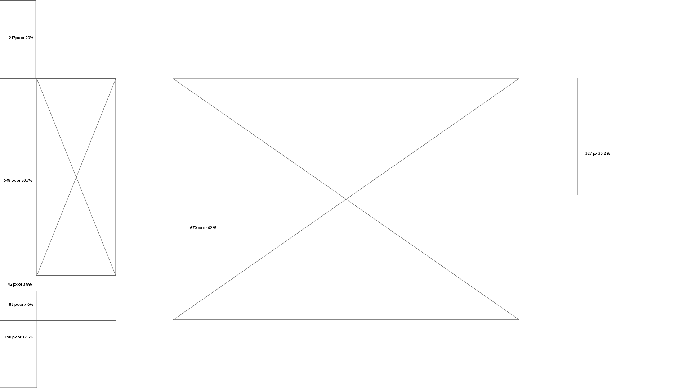
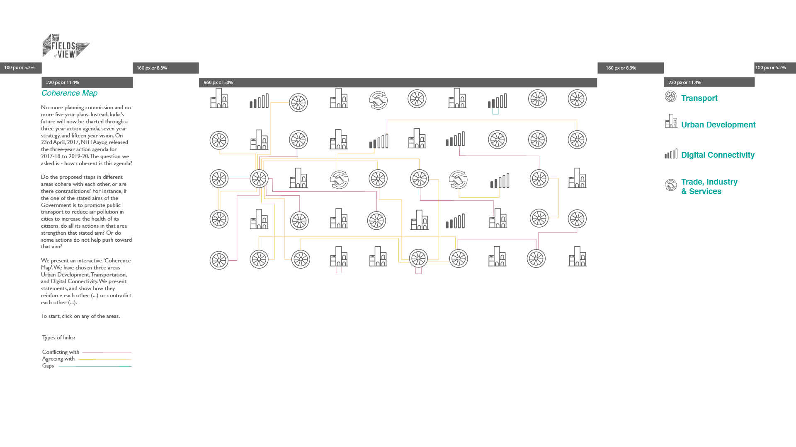
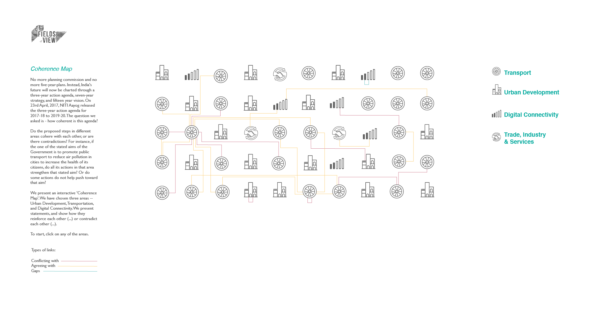
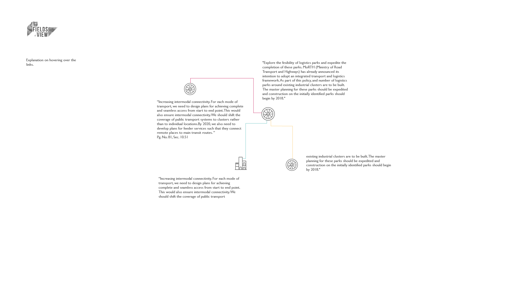
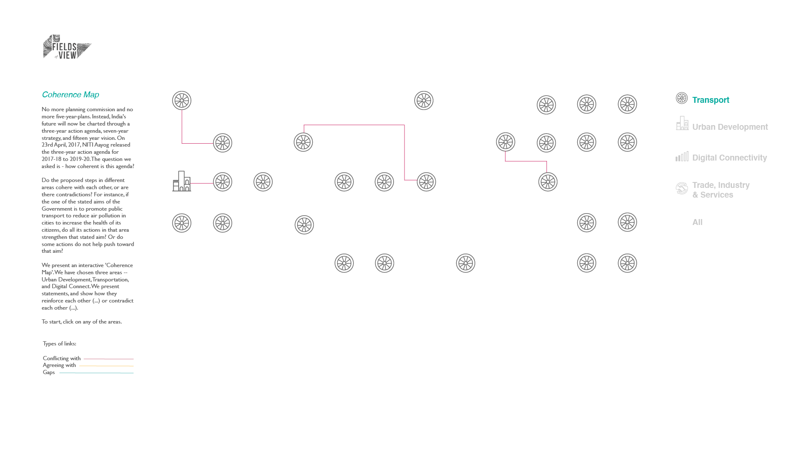
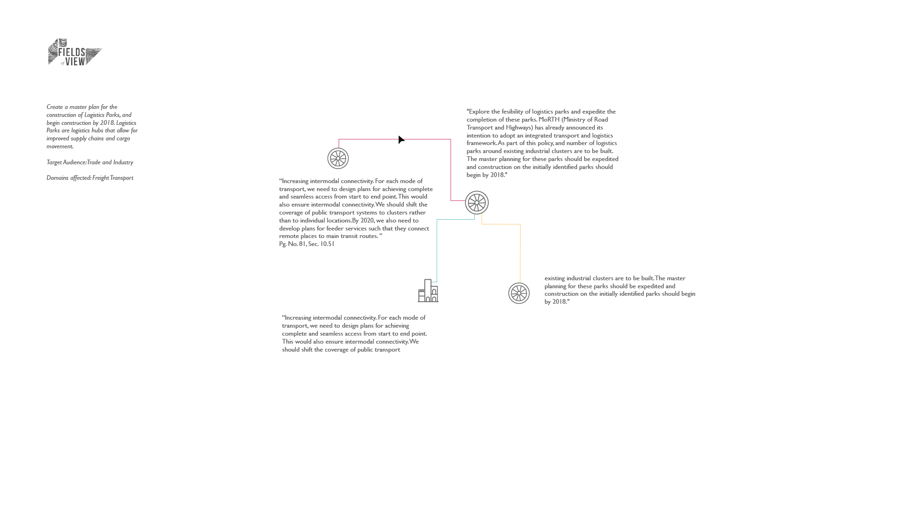

# Niti Aayog Coherence Map

This a coherence map created after analysing the Niti Aayog Document.

## Requirements
The coherence map uses the below to work properly:

* JavaScript
* D3js
* HTML
* CSS
* jQuery

Example for reference [http://bl.ocks.org/d3noob/5141278](http://bl.ocks.org/d3noob/5141278)

## Data
The Data to be parsed for the Coherence map is placed in [graph.json](graph.json)
The data format is of type JSON and is as follows:
```
{
  "graph": [],
```
This is merely to call the graph from a div tag
```
  "links": [
    {"source": 1, "target": 2, "desc":"1->2 In the next three", "link":1},
    {"source": 2, "target": 3},
  ],
```
This contains the link information 
&nbsp;&nbsp;&nbsp;&nbsp;&nbsp;&nbsp;the values in source and target refers to the id of the node
&nbsp;&nbsp;&nbsp;&nbsp;&nbsp;&nbsp;the description has text explaining what the link means
&nbsp;&nbsp;&nbsp;&nbsp;&nbsp;&nbsp;the link key refers to the kind of link 
&nbsp;&nbsp;&nbsp;&nbsp;&nbsp;&nbsp;&nbsp;&nbsp;&nbsp;&nbsp;&nbsp;&nbsp;(0 - gap, 1 - conflicting, 2 - helping) each of which has their respective colors refer the style section.
```
  "nodes": [{ 
      "size": 60,
      "score": 1, 
      "id": 1, 
      "type": "Transport",
      "desc":"In the next three years, we should enhance the transport and connectivity network such that it facilitates the efficient movement of people and goods, is accessible, affordable, safe, environmentally sustainable and develops in a manner that is aligned with industry demands.(Page 73, 10.3)", "exp":"In the next three years all development is intended to facilitate the movement of people and goods."
    },]
}
```
Each node is represented by an image as per their type the description of the node is associated with a statement and the usage of the statement is explained in the Functionality section. The size is a modifier to change the size of each the node's icon. The score is a modifier which works like the weight of each node in a weighted graph.

If data doesn't exist to complete this map you can add dummy data as per your convenience, however the data format is fixed as JSON.

## Style
This heading contains the styles required for this project

* Body Text
    *   Font : Gill Sans Regular
    *   Size : 14 pts
    *   Color : #606060
* Heading text #1
    * Font : Helvetica Oblique
    * Size : 19 pts
    * Color : #00A99D
* Filter text 
    * Font : Helvetica Bold
    * Size : 19 pts
    * Color : #00A99D
    * Fade out color : #C9C9C9
* Icons


    * Size in map : 45x45 px
    * Size in filter : 27.4x27.4 px


    * Size in filter : 27.4x27.4 px


    * Size in map : 45x35.3 px
    * Size in filter : 30.3x24 px


    * Size in filter : 30.3x24 px


    * Size in map : 45x48.4 px 
    * Size in filter : 30.5x33 px


    * Size in filter : 30.5x33 px


    * Size : 120x61 px


    
    * Size in map : 45x45 px
    * Size in filter : 27.4x27.4 px 


    * Size in filter : 27.4x27.4 px

* Layout Dimension







* Links
    * Conflicting With
        * Color : #D17D91
        * Line thickness : 1 pt
    * Agreeing With
        * Color : #FCCE75
        * Line thickness : 1 pt
    * Gaps
        * Color : #6AC2C3
        * Line thickness : 1 pt

    

## Functionality
On the left side panel of the landing page, the introductory write up about the coherence map needs to be present. The Legend also needs to be present on the left panel in all pages.


The coherence map along with its nodes of their respective domains is displayed on the center of the page. Each node is a statement from the Niti Aayog document.  The node is represented by the icon of one of the listed domains. 

The listed domains are on the right side panel of the page. Which acts as a filter to visualize the kind of nodes represented on the map. Clicking on this filter (domain) would display the nodes of that domain and their links within and to other domains.


There are three kinds of links represented by three different colors. The links being - Agreeing with, Conflicting with and gaps.

To view the statements and their links to other statements, the reader should click on the node. The Interactive displays the source node clicked along with the inter/intra node connections. The interactive then displays the comments of the source node as well as the other connected target node's statements as represented below.


By hovering over the link lines, the link description and explaination is displayed on the left panel a sshown in the wireframe below.


One can go back to the landing page by clicking on the white space of the page.


## Documentation

This space is to write a documentation for the code and its usage.

Ensure that the code has comments and follows a functional style with basic coding practices such as naming conventions etc.
